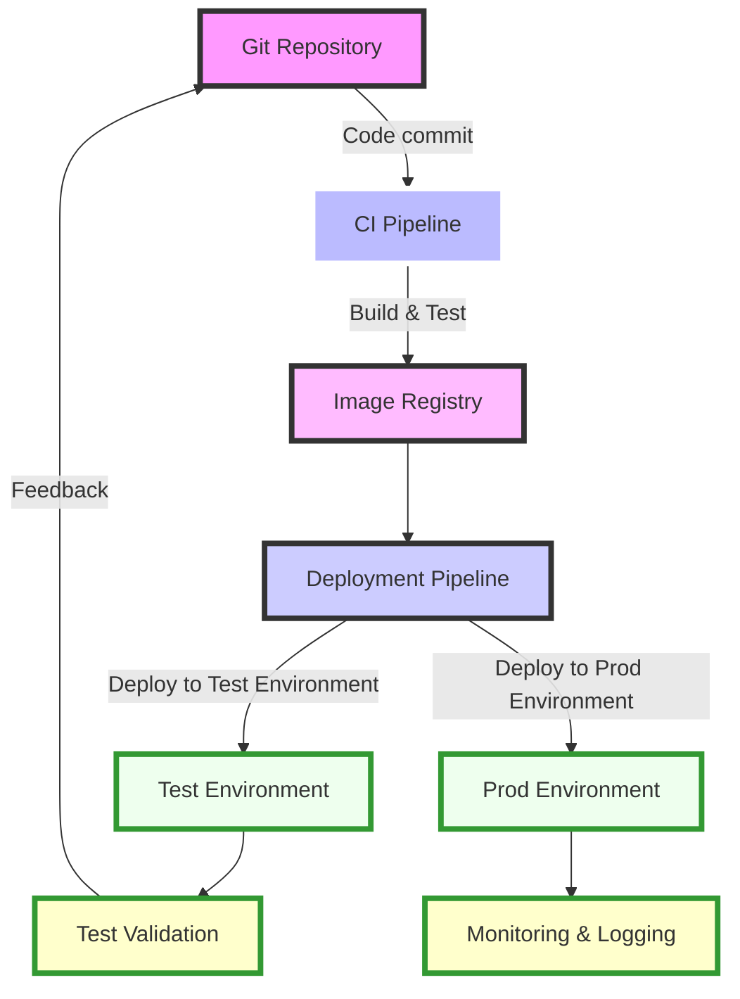

# Diagrams

Various diagrams that I'd like to keep around for easy reference and re-use.

## DrawIO (diagrams.net)

XML-based file format, simple JPEG/PNG/SVG/PDF export

## Mermaid

Text-based diagram syntax that enables embedded diagrams to render alongside their surrounding document, such as the below diagram which is a text box:

