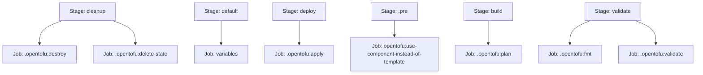

# Pipeline Diagram

```mermaid
graph TD
    cleanup["Stage: cleanup"]
    opentofu:use-component-instead-of-template["Job: opentofu:use-component-instead-of-template"]
    default["Stage: default"]
    deploy["Stage: deploy"]
    .opentofu:apply["Job: .opentofu:apply"]
    .opentofu:destroy["Job: .opentofu:destroy"]
    .opentofu:fmt["Job: .opentofu:fmt"]
    variables["Job: variables"]
    .pre["Stage: .pre"]
    .opentofu:delete-state["Job: .opentofu:delete-state"]
    .opentofu:plan["Job: .opentofu:plan"]
    build["Stage: build"]
    validate["Stage: validate"]
    .opentofu:validate["Job: .opentofu:validate"]
    default --> variables
    .pre --> opentofu:use-component-instead-of-template
    validate --> .opentofu:fmt
    validate --> .opentofu:validate
    build --> .opentofu:plan
    deploy --> .opentofu:apply
    cleanup --> .opentofu:destroy
    cleanup --> .opentofu:delete-state
```
