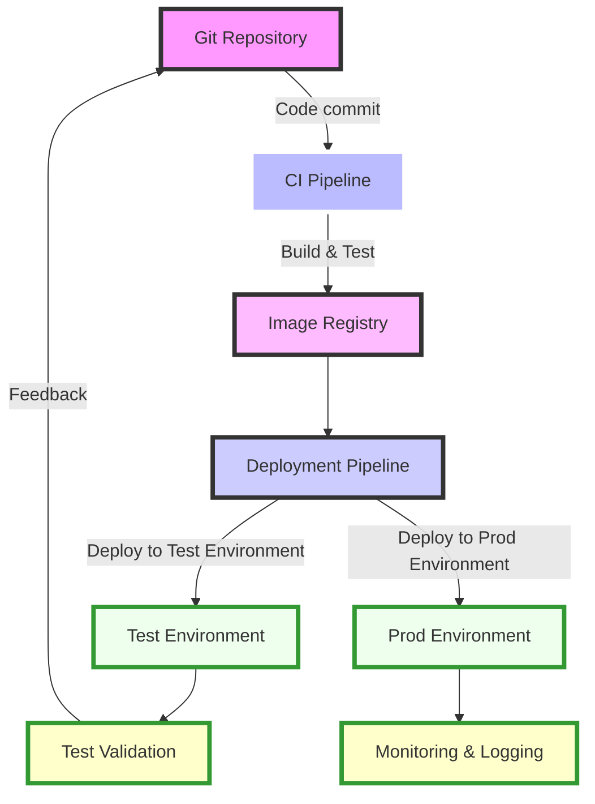

# Mermaid Diagrams

This README dynamically displays Mermaid diagrams found in the .mmd files within this directory.

## Diagram: mermaid/gitops-basic

```mermaid
graph TD
    A[Git Repository] -->|Code commit| B[CI Pipeline]
    B -->|Build & Test| C[Image Registry]
    C --> D[Deployment Pipeline]
    D -->|Deploy to Test Environment| E[Test Environment]
    D -->|Deploy to Prod Environment| F[Prod Environment]
    E --> G[Test Validation]
    G -->|Feedback| A
    F --> H[Monitoring & Logging]

    classDef git fill:#f9f,stroke:#333,stroke-width:4px;
    classDef ci fill:#bbf,stroke:#fff,stroke-width:4px;
    classDef registry fill:#fbf,stroke:#333,stroke-width:4px;
    classDef deployment fill:#ccf,stroke:#333,stroke-width:4px;
    classDef env fill:#efe,stroke:#393,stroke-width:4px;
    classDef monitoring fill:#ffc,stroke:#393,stroke-width:4px;

    class A git;
    class B ci;
    class C registry;
    class D deployment;
    class E,F env;
    class G monitoring;
    class H monitoring;

```

