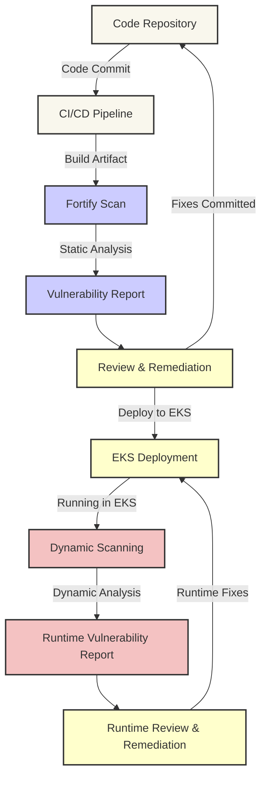

# Fortify Integration with AWS EKS

This diagram depicts the integration of the Fortify scanning tool with AWS Elastic Kubernetes Service (EKS). Fortify provides static and dynamic code analysis to identify security vulnerabilities in application code before and after deployment in EKS. This process helps ensure that applications are secure by design and in operation.

### Explanation of the Diagram Components

- **Code Repository**: Where the application code is stored and versioned. Changes here trigger the CI/CD process.
- **CI/CD Pipeline**: Automates the building and testing of the code, preparing artifacts for deployment and scanning.
- **Fortify Scan**: Fortify performs static code analysis on the build artifacts, looking for security vulnerabilities within the code.
- **Vulnerability Report**: Generated by Fortify, this report details any security issues found during the static analysis.
- **Review & Remediation**: Developers review the vulnerability report and make necessary changes to the code to remediate found issues.
- **EKS Deployment**: Deployed artifacts are pushed to EKS, where the application runs.
- **Dynamic Scanning**: While the application runs in EKS, Fortify performs dynamic scanning to identify runtime vulnerabilities.
- **Runtime Vulnerability Report**: Similar to the static vulnerability report, but focuses on vulnerabilities that occur during runtime.
- **Runtime Review & Remediation**: Any issues identified during dynamic scanning are reviewed, and remediation actions are taken to ensure ongoing security in the production environment.

This diagram outlines a comprehensive security integration for applications running on EKS, leveraging Fortify's capabilities to maintain a secure application lifecycle from development to production.
