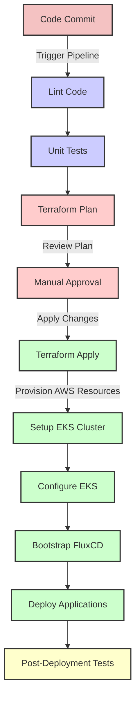

# GitLab CI/CD Pipeline for Terraform and FluxCD

This document illustrates the GitLab CI/CD pipeline designed for deploying infrastructure as code (IaC) with Terraform to provision AWS resources, including an EKS cluster. It also details the bootstrapping of FluxCD to deploy necessary platform applications on Kubernetes.

## Pipeline Diagram

## Explanation of Pipeline Components

- **Code Commit**: Initiates the CI/CD process, triggered by a commit to the repository.
- **Lint Code**: Performs static code analysis to ensure code quality and adherence to standards.
- **Unit Tests**: Executes unit tests to validate the functionality of the code before any deployment occurs.
- **Terraform Plan**: Generates an execution plan for Terraform, which allows developers and operations teams to review what Terraform will do before it makes any changes to the infrastructure.
- **Manual Approval**: Acts as a checkpoint requiring manual review and approval of the Terraform plan to ensure that all changes meet the necessary standards and policies before proceeding.
- **Terraform Apply**: Applies the approved Terraform configuration to provision AWS resources, including setting up an EKS cluster.
- **Setup EKS Cluster**: Involves the initial configuration of the EKS cluster once it has been provisioned by Terraform.
- **Configure EKS**: Involves additional configurations for the EKS cluster, potentially including networking and security settings.
- **Bootstrap FluxCD**: Sets up FluxCD on the newly configured EKS cluster, enabling it to manage deployments automatically based on configurations stored in Git.
- **Deploy Applications**: Utilizes FluxCD to deploy the necessary Kubernetes applications as defined by the configurations in the repository.
- **Post-Deployment Tests**: Executes tests to verify that the applications are running correctly and interacting as expected within the Kubernetes environment.