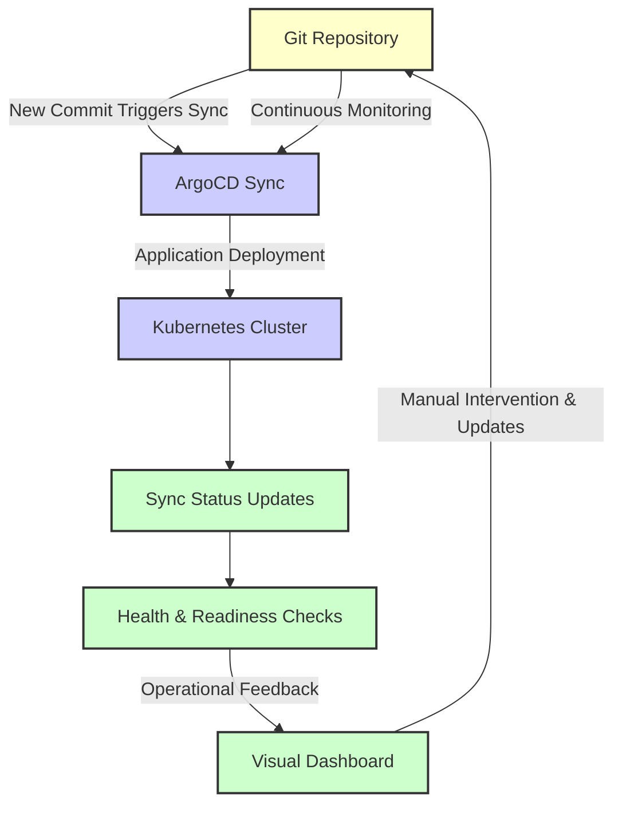

# GitOps - ArgoCD Diagram

- Git Repository: The central repository for storing configuration and declarative definitions.
- ArgoCD Sync: ArgoCD watches for changes in the Git repository and initiates sync when new commits are detected.
- Application Deployment: Applications are deployed according to the latest configurations.
- Kubernetes Cluster: The deployment environment managed by Kubernetes.
- Sync Status: ArgoCD provides a real-time status update on the sync process.
- Health & Readiness Checks: After deployment, ArgoCD checks for the health and readiness of the deployed applications.
- Visual Dashboard: ArgoCD offers a graphical dashboard to visualize the state of applications.
- Manual Sync Override: Administrators can manually trigger a sync to override automated processes if needed.
    
