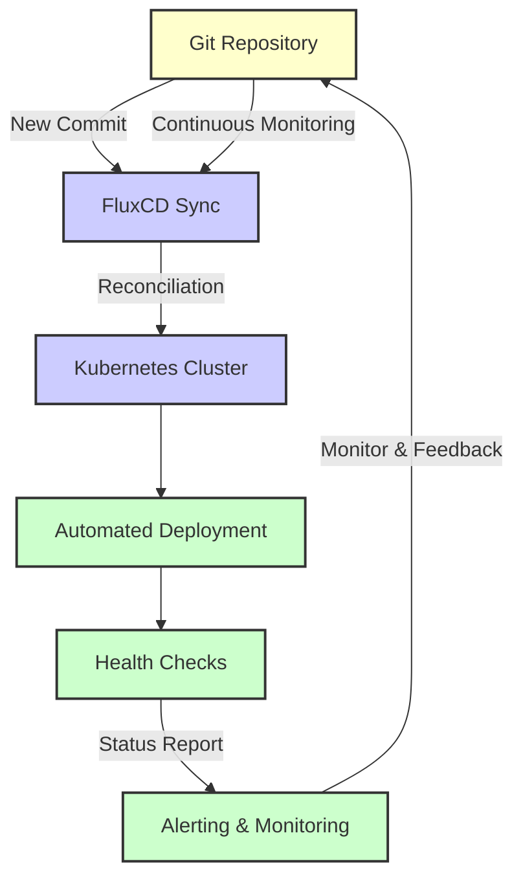

# FluxCD Deployment Workflow

This diagram demonstrates the FluxCD workflow, which automatically synchronizes and applies changes from a Git repository to a Kubernetes cluster. FluxCD actively monitors the repository, applies the changes through a reconciliation process, and manages the lifecycle of applications within the cluster while providing feedback and monitoring.

