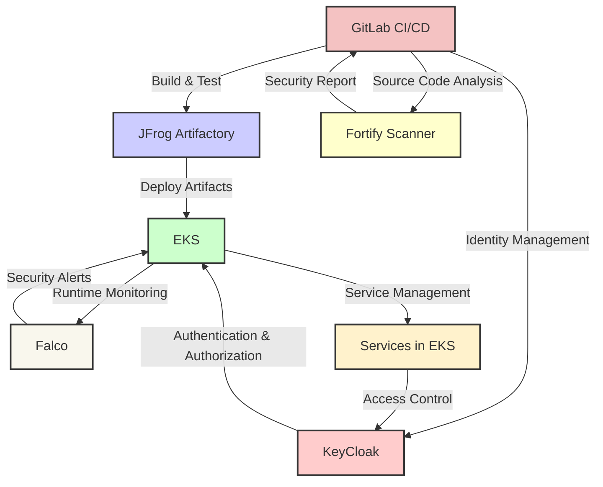

# Technology Integration Overview

This diagram provides a high-level overview of how EKS, KeyCloak, JFrog Artifactory, Fortify Scanner, Falco, and GitLab interact in an integrated technology stack. Each component plays a critical role in ensuring the security, efficiency, and reliability of application deployment and management within a Kubernetes environment.

### Explanation of the Diagram Components

- **GitLab CI/CD**: Manages the source code repository, initiates and controls the build and test processes, and conducts source code analysis using the Fortify Scanner.
- **JFrog Artifactory**: Stores build artifacts securely and serves as the repository from which EKS deployments are made.
- **EKS (Elastic Kubernetes Service)**: Hosts the Kubernetes environment where applications are deployed and managed.
- **Fortify Scanner**: Analyzes source code for vulnerabilities, with findings fed back to GitLab to potentially trigger further actions.
- **Falco**: Monitors runtime behavior within EKS to detect and alert on suspicious or anomalous activity based on predefined rules.
- **KeyCloak**: Manages identity and access control within the system, interfacing with EKS to handle authentication and authorization for services.
- **Services in EKS**: Represents the various applications and services running within the Kubernetes environment, managed through EKS and protected by KeyCloak's access controls.

This diagram visually ties together how these technologies interact to create a secure, scalable, and managed application deployment environment, emphasizing the interplay between development, deployment, and security aspects.
