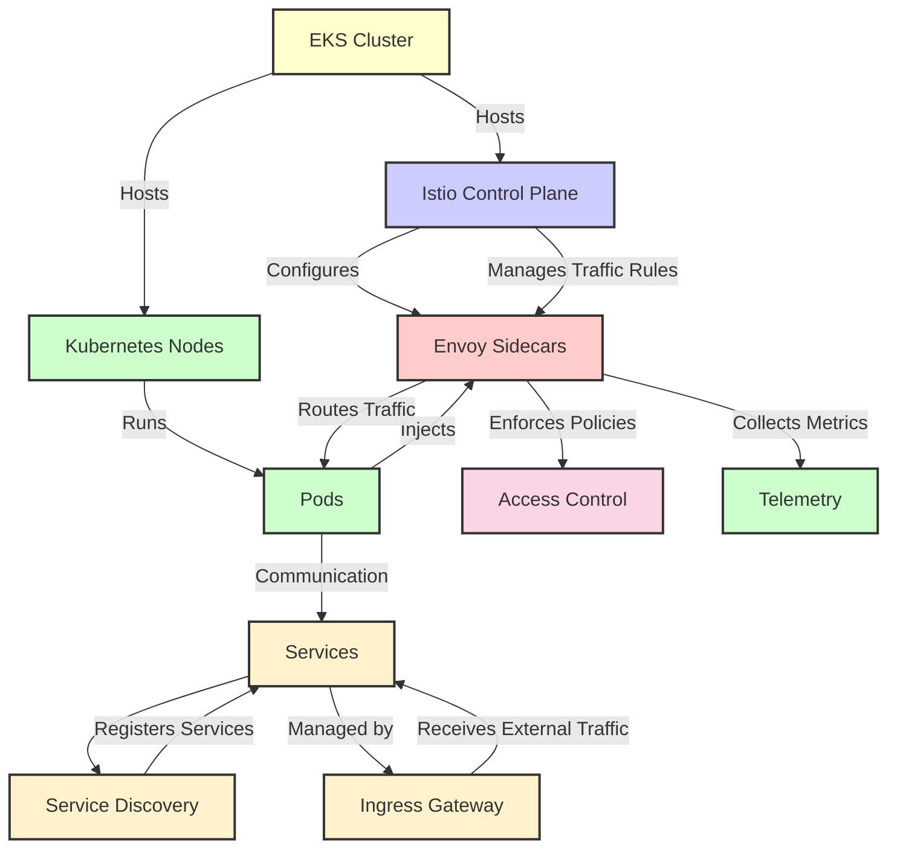

# Istio Service Mesh on EKS

Explanation of the Diagram Components

- EKS Cluster: The overall Kubernetes cluster managed by EKS.
- Istio Control Plane: Manages Istio's operational logic, including traffic management, policies, and configuration.
- Kubernetes Nodes: Physical or virtual machines that host Kubernetes pods.
- Envoy Sidecars: Deployed alongside each service pod to manage network communication.
- Pods: Contains one or more containers (including Envoy proxies when Istio is used).
- Services: Kubernetes Services that abstract the logic of pod access.
- Service Discovery: Component of Istio that handles the discovery of services within the mesh.
- Ingress Gateway: Manages access to the services from external sources.
- Access Control: Policies enforced by the sidecars for service-to-service communication.
- Telemetry: Collection of metrics and logging data facilitated by the sidecars.

