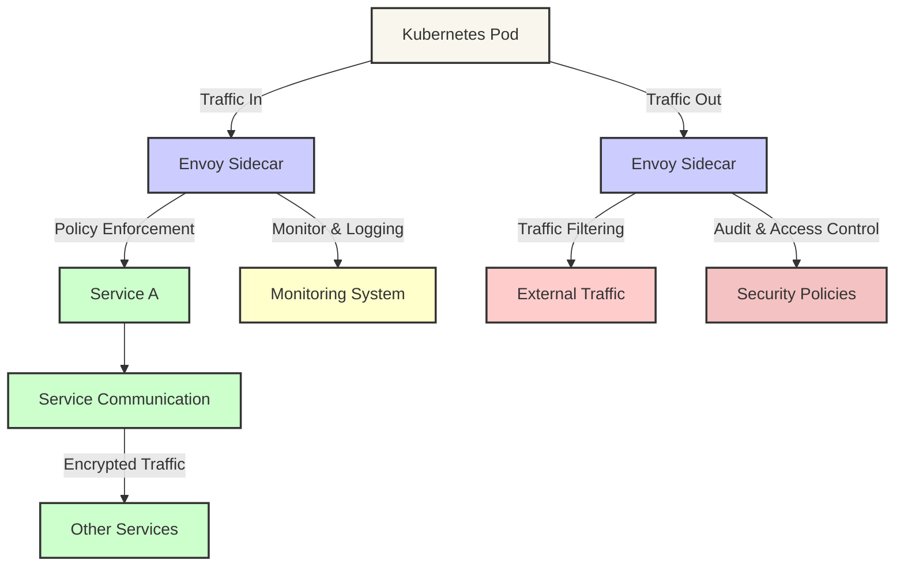

# Istio Envoy Sidecar Pattern

## Explanation of the Diagram Components

- **Kubernetes Pod**: Represents the primary unit of deployment in Kubernetes, which contains one or more containers.
- **Envoy Sidecar**: A dynamically injected proxy that manages network communication to and from the pod, providing a layer of security and functionality enhancements.
- **Service A**: The main service running within the pod, receiving filtered and policy-enforced traffic from the Envoy sidecar.
- **Service Communication**: Interactions between services within the mesh, where traffic is typically encrypted by the sidecar.
- **Other Services**: Other microservices within the Istio mesh that communicate securely with Service A.
- **External Traffic**: Traffic that either enters or exits the mesh, handled by the Envoy sidecar to enforce security measures like traffic filtering and TLS termination.
- **Monitoring System**: Collects logs and monitoring data from the Envoy sidecar to analyze network activity and detect potential security issues.
- **Security Policies**: Security policies that are enforced by the sidecar, including access controls and audit logging.