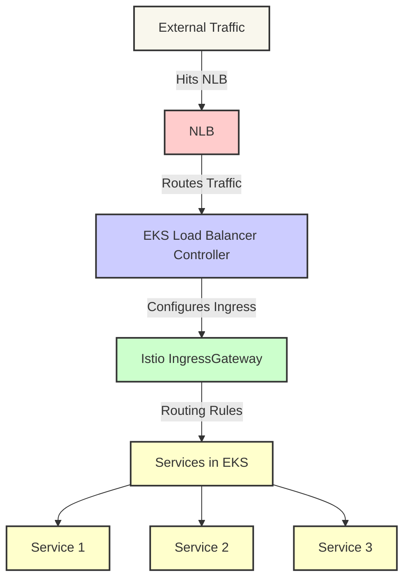

# Istio IngressGateway with AWS NLB Integration

This diagram illustrates how the Istio IngressGateway integrates with the EKS load balancer controller to utilize an AWS Network Load Balancer (NLB) for managing ingress traffic. The NLB serves as the entry point for external traffic, which is then directed to the Istio IngressGateway. This gateway routes the traffic to the appropriate services within the Kubernetes cluster based on the configured routing rules.

### Explanation of the Diagram Components

- **External Traffic**: Represents traffic coming from outside the AWS cloud environment.
- **NLB (Network Load Balancer)**: Acts as the front-facing entry point for all incoming traffic, distributing it across multiple available targets to enhance fault tolerance and scalability.
- **EKS Load Balancer Controller**: Manages the lifecycle of AWS load balancers in response to Kubernetes Ingress resources and service annotations. It automates the configuration of the load balancers according to defined Ingress rules.
- **Istio IngressGateway**: Serves as the gateway within Istio's service mesh architecture, handling incoming traffic according to Istio's routing rules and directing it to the appropriate internal services.
- **Services in EKS**: Represents Kubernetes services that are the ultimate destination for the routed traffic, potentially including various applications deployed within the cluster.

This diagram provides a visual representation of how external traffic is managed through a combination of AWS infrastructure and Istio's capabilities within an EKS deployment, emphasizing the role of the NLB and Istio IngressGateway in facilitating efficient traffic routing.
