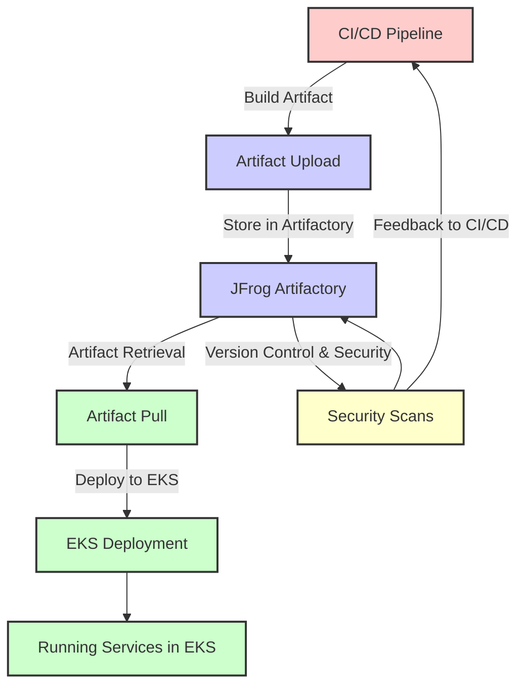

# Artifacts Storage and Deployment using JFrog Artifactory to EKS

This diagram outlines the workflow of storing build artifacts in JFrog Artifactory from CI/CD pipelines and subsequently deploying these artifacts into AWS Elastic Kubernetes Service (EKS). The process ensures that all deployment artifacts are version-controlled, secured, and reliably deployed to the production environment.

### Explanation of the Diagram Components

- **CI/CD Pipeline**: Initiates the process by building the application and creating deployable artifacts.
- **Artifact Upload**: Artifacts are uploaded to JFrog Artifactory immediately after they are built.
- **JFrog Artifactory**: Serves as the central repository for all deployment artifacts. Artifactory manages version control and ensures that artifacts are securely stored and available for deployment.
- **Artifact Retrieval**: When deployment to EKS is initiated, the required artifacts are retrieved from Artifactory.
- **Deploy to EKS**: Artifacts are deployed into AWS Elastic Kubernetes Service, where they are rolled out to form running services.
- **Running Services in EKS**: Represents the services now operating in the EKS environment, post-deployment.
- **Security Scans**: As part of the artifact management process, security scans can be conducted on stored artifacts in Artifactory to ensure compliance and security before deployment.
- **Feedback to CI/CD**: Results from security scans and other feedback mechanisms may lead to modifications in the CI/CD process, triggering new builds or updates.

This diagram visually captures the integration of JFrog Artifactory into a CI/CD and EKS deployment workflow, highlighting the critical role Artifactory plays in artifact management, security, and deployment processes.

